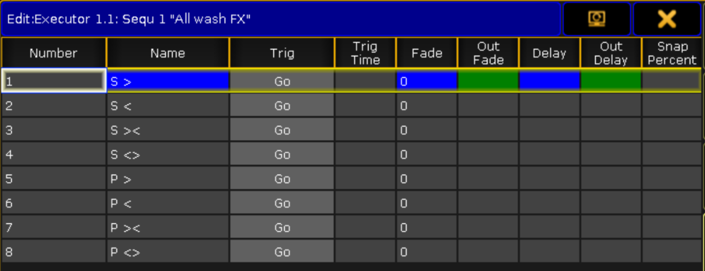
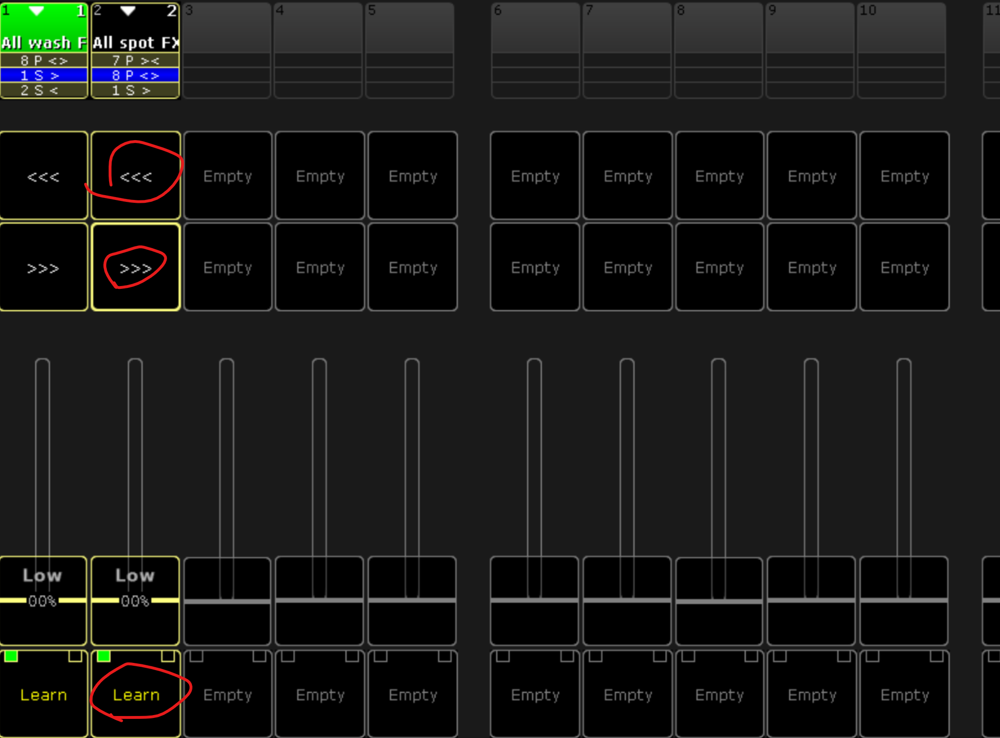
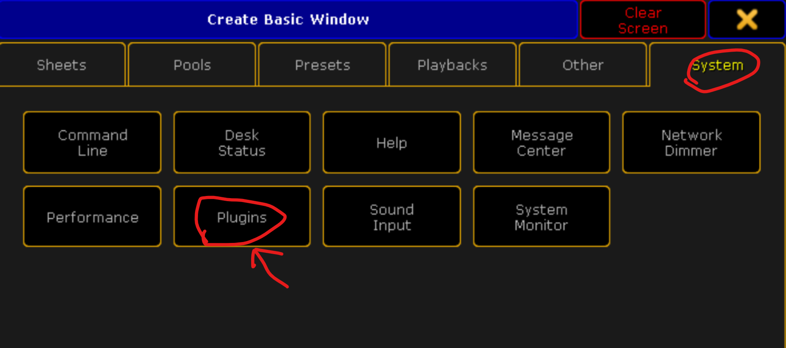
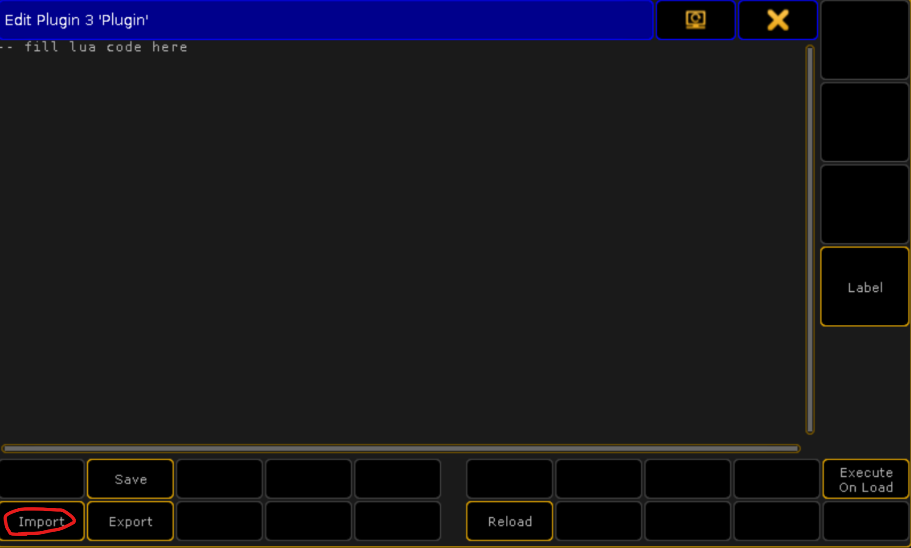
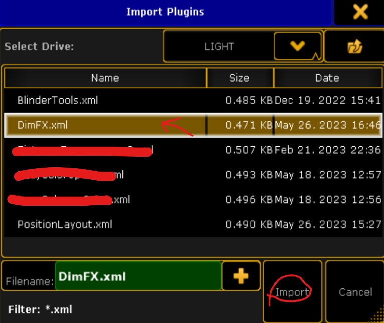

## {{ page.title }}

Это **бесплатный** плагин для grandMA2, который позволяет создать для выбранной группы приборов экзекьютор с 8-мью основными диммерными эффектами. Для живой работы (баскинг) я обычно делаю себе такой 
экзекьютор для заливки и всех основных групп лучевых приборов. Надоело это делать каждый раз руками, решил сделать плагин, который будет делать это за меня, ну и заодно поделиться им со всеми.

Для каждой необходимой группы плагин необходимо запускать заново. В итоге создаются такие экзекьюторы:

Под фейдером находится кнопка **Learn**, которая задает скорость эффекта, над фейдером кнопки **< < <** и **> > >**, которые позволяют выбрать необходимый эффект. Алгоритм работы с такими экзекьюторами следующий:

1. Началась песня на концерте, с опущенными фейдерами нажимаем минимум 3 раза кнопки Learn
1. Выбираем кнопками **< < <** и **> > >** нужный эффект
1. Плавно его выводим, в более динамичных моментах музыки поднимаем фейдер полностью
1. Более интересно эффекты работаю при открытом значении диммера на приборах - получается эффект пульсации

### Создаваемые эффекты

1. S > - sin вперед
1. S < - sin назад
1. S >< - sin к центру
1. S <> - sin от центра
1. P > - pwm вперед
1. P < - pwm назад
1. P >< - pwm к центру
1. P <> - pwm от центра

### Использование:
Плагин представляет собой архив, в котором находятся два файла:

- DimFX.lua
- DimFX.xml

Оба этих файла необходимо положить в директорию *gma2/plugins* на флешке, либо в директорию плагинов во внутренних файлах grandMA2 onPC.

Далее необходимо в созданном шоу с запатченными приборами и созданными группами приборов импортировать плагин. Для этого создадим окно с пулом плагинов:

Теперь необходимо открыть редактирование любой свободной ячейки из пула плагинов. Это можно сделать двумя способами:

- Кнопка **Edit** на пульте и нажать на ячейку
- Правой клавишей мыши нажать на ячейку

В открывшемся окне необходимо нажать кнопку **Import**

Выбрать из списка дисков флешку и выбрать плагин DimFX.xml

После этого в редакторе плагина необходимо нажать кнопку **Save** и закрыть окно редактирования плагина.

Теперь его можно запускать. Это делается нажатием на ячейку плагина в пуле плагинов. Плагин спросит номер группы, для которой необходимо сделать эффекты, номер экзекьютора, куда их сохранить и название для этого экзекьютора.

### Важные нюансы:

- Плагин поставляется **КАК ЕСТЬ**! Я **не отвечаю** за его работу, за любые неполадки, которые могут возникнуть в вашем шоу при работе с этим плагином. Но всегда по возможности готов помочь, подсказать и исправить баги.
- Плагин бесплатный. Но при его распространении, пожалуйста, не удаляйте указание авторства.

### Скачать

Скачать плагин можно бесплатно [по этой ссылке](DimFX.zip)

