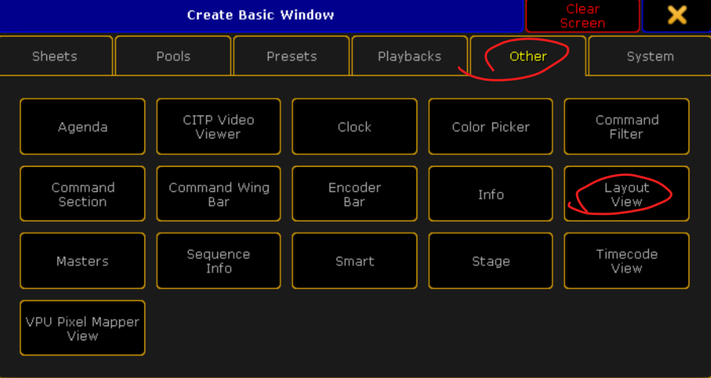

## {{ page.title }}

Это плагин для grandMA2, который позволяет создать удобную рабочую область смены позиций приборов для применения в живой работе за пультом (баскинг). **Плагин стабильно работает с версиями grandMA2 3.8... и выше.** 

На более старых версиях работа не гарантирована.

### Использование:
Плагин представляет собой архив, в котором находятся два файла:

- PositionLayout.lua
- PositionLayout.xml

Оба этих файла необходимо положить в директорию *gma2/plugins* на флешке, либо в директорию плагинов во внутренних файлах grandMA2 onPC.

Далее необходимо в созданном шоу с запатченными приборами и созданными группами приборов импортировать плагин. Для этого создадим окно с пулом плагинов:

Теперь необходимо открыть редактирование любой свободной ячейки из пула плагинов. Это можно сделать двумя способами:

- Кнопка **Edit** на пульте и нажать на ячейку
- Правой клавишей мыши нажать на ячейку

В открывшемся окне необходимо нажать кнопку **Import**

Выбрать из списка дисков флешку и выбрать плагин PositionLayout.xml

После этого в редакторе плагина необходимо нажать кнопку **Save** и закрыть окно редактирования плагина.

Теперь его можно запускать. Это делается нажатием на ячейку плагина в пуле плагинов. Плагин начнет спрашивать номера групп, для которых необходимо сделать кнопки смены позиций. У меня в демо-шоу это две группы:

1. All wash
2. All spot

Поэтому на первый вопрос от плагина я отвечаю **1**, на второй **2**, на третий просто нажимаю **Please** (**Enter**). Далее плагин задаст ещё несколько вопросов:

- Position Preset Start - номер пресета по позиции, начиная с которого плагин создаст свои пресеты. Плагин создает 7 позиций, убедитесь, что начиная с этого стартового номера у вас нет важных позиций, которые нельзя перезаписать.
- ImageLoad Number - номер первой картинки в пуле картинок, плагин создаёт 17 изображений, плюс по 7 изображений для каждой группы, которые были указаны при запуске плагина. Убедитесь, что начиная с этого стартового номера у вас нет важных изображений, которые нельзя перезаписать.
- MacroLoad Number - номер первого макроса в пуле макросов. Плагин создает (кол-во групп * 8 + 2) макроса. Убедитесь, что начиная с этого стартового номера у вас нет важных макросов, которые нельзя перезаписать.
- Seq Number - номер первой секвенции в пуле секвенций. Плагин создает по одной секвенции для каждой из выбранных групп. Убедитесь, что начиная с этого стартового номера у вас нет важных секвенций, которые нельзя перезаписать.
- Layout Number - номер layout-а, на котором будут располагаться кнопки плагина. Если будет указан существующий, он будет перезаписан.

>> Если вы запускаете плагин в пустом шоу, где есть только запатченные приборы и группы, на все вопросы, кроме первого (выбор групп) рекомендую нажимать **Please** (**Enter**) и ничего не менять.

Далее необходимо создать окно для отображения Layout-а плагина

И статично выбрать номер Layout-а, указанный на последнем шаге настроек плагина

Для демонстрации работы плагина я сделал следующую страницу:

>> **Плагин создает позиции, думая, что приборы в группе висят в одну линию**, поэтому возможно возникнет необходимость их поправить. Сделать это можно так:

1. Выбираем группу
1. Накручиваем в программаторе нужную позицию
1. Нажимаем кнопку **Store** 
1. Нажимаем на один из семи пресетов позиций, созданных плагином
1. Выбираем режим **Merge**

После этого плагином можно пользоваться. Кнопка **Fade** спрашивает у пользователя время для перехода между позициями и устанавливает его. Время указывается в секундах.
Время перехода применяется сразу ко всему плагину, т.е. будет работать сразу у всех групп. Для отключения времени фейда необходимо задать значение **0**.

### Важные нюансы:

- Плагин поставляется **КАК ЕСТЬ**! Я **не отвечаю** за его работу, за любые неполадки, которые могут возникнуть в вашем шоу при работе с этим плагином. Но всегда по возможности готов помочь, подсказать и исправить баги
- Плагин поддерживает только изображения **семи** стандартных позиций, которые на мой взгляд встречаются чаще всего в концертных световых работах
- Не пользуйтесь плагином бесплатно, я потратил много времени на его создание, а вам он может сократить много времени при создании шоу. Давайте уважать чужой труд.

### Как приобрести:

Плагин нельзя купить в юридическом понимании этого слова, но если вы угостите меня вкусным стейком, я поделюсь с вами файлом плагина. Стейк в том месте, где я их покупаю, стоит **от 1000₽**.
Чтобы это сделать, напишите мне в телегу [@artemsysolyatin](https://t.me/artemsysolyatin) или на почту artem@sysolyatin.com. Я расскажу, что для этого нужно сделать.

И да, это доступно только для тех, у кого есть Российская банковская карта.

### Благодарности:

Отдельное спасибо [Александру Сальцеву](https://alexsaltsev.ru/) за некоторые инфраструктурные части плагина, которые я подсмотрел у него в плагинах, а ещё спасибо всем, кто плагин тестировал.

### Тестирование в реальном шоу:

